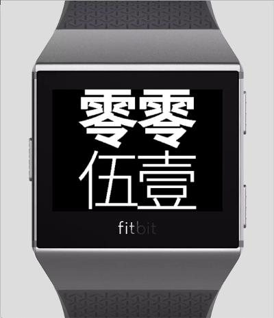
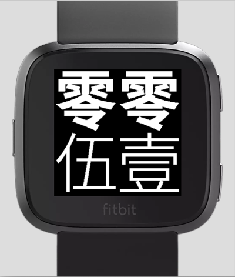

A Chinese clockface for Fibit ionic and versa smartwatches.

The typfaces are [NotoSansCJKtc](https://github.com/googlei18n/noto-cjk) from Google.

Credits:
- [Lunar calendar library](https://github.com/jjonline/calendar.js)
- [SDK Settings](https://github.com/Fitbit/sdk-moment)